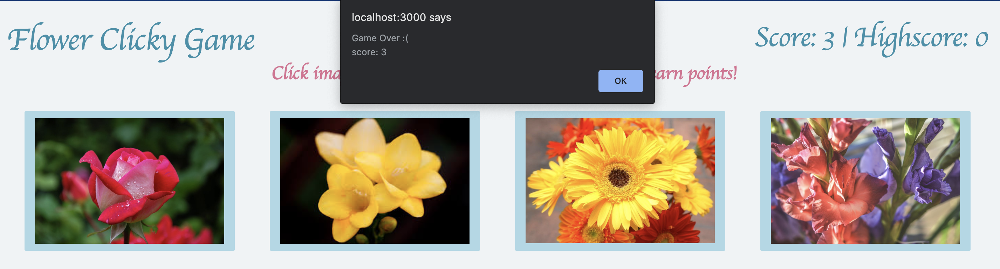

# React-Flower-Memory-Game
An web app that allows user to play a memory game.

## Table of contents

* [About this project](#about-this-project)
* [Project requirements](#project-requirements)
* [Live](#live)
* [Structure of the project](#structure-of-the-project)
* [Screenshots](#screenshots)
* [Technologies used to create app](#technologies-used)
* [How to use the app](#how-to-use-app)

##  About this project

For this assignment, I created a memory game with React. It required me to break up my application's UI into components, manage component state, and respond to user events.
 

##  Project requirements
1. Check out the [example solution](https://clicky-game.netlify.com/) and study the app's basic functionality.

2. Create a new React application using [Create React App](https://github.com/facebookincubator/create-react-app).

3. The application should render different images (of your choice) to the screen. Each image should listen for click events.

4. The application should keep track of the user's score. The user's score should be incremented when clicking an image for the first time. The user's score should be reset to 0 if they click the same image more than once.

5. Every time an image is clicked, the images rendered to the page should shuffle themselves in a random order.

6. Once the user's score is reset after an incorrect guess, the game should restart.

7. When complete, the application should be deployed to Github Pages. See the README generated with Create React App for instructions on deploying the application to Github Pages.

##  Live
App is available live through GitHub and Heroku

* https://github.com/ATATE13/React-Flower-Memory-Game
* https://atate13.github.io/React-Flower-Memory-Game/

##  Structure of the project
<ul> 
<li>node_modules</li>
<li>public</li>
    <ol>images</ol>
    <ol>favicon.ico</ol>
    <ol>index.html</ol>
    <ol>manifest.json</ol>
<li>src</li>
    <ul>components</ul>
        <li>Card</li>
            <ol>Card.css</ol>
            <ol>Card.js</ol>
            <ol>index.js</ol>
        <li>Header</li>
            <ol>Header.css</ol>
            <ol>Header.js</ol>
            <ol>index.js</ol>
        <li>Wrapper</li>
            <ol>Wrapper.css</ol>
            <ol>Wrapper.js</ol>
            <ol>index.js</ol>
    <ul>App.css</ul>
    <ul>App.js</ul>
    <ul>App.test.js</ul> 
    <ul>cards.json</ul>
    <ul>index.css</ul>
    <ul>logo.svg</ul>
    <ul>serviceWorker.js</ul>
</ul>

##  Screenshots
Images of Flower Clicky Game

##  Technologies used to create the app
* HTML5
* CSS
* Javascript (https://www.javascript.com/)
* JQuery (https://jquery.com/)
* Node JS (https://nodejs.org/)
* React (https://reactjs.org/)
* Babel (https://babeljs.io/)
* JSX (https://reactjs.org/docs/introducing-jsx.html)

##  How to use app
* Once the app opens, read the berief instructions at the top to "Click image to begin! Only click each image once to earn points!"
* The player will click each picture and the score counter will go up by one. 
* If the player clicks the same picture twice, the game over alert will pop up and end the game.
* The highscore will display the players highest score. 

